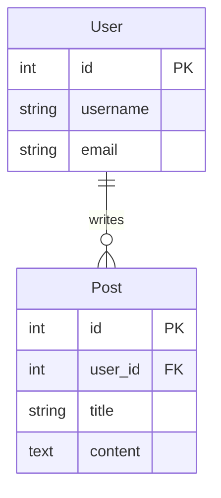

# Mermaid ERD Export for Database Schemas

## Overview

VPB now supports exporting Entity-Relationship Diagrams (ERD) in Mermaid format, specifically designed for database schema visualization and documentation. This feature allows you to model database structures and relationships using VPB's visual interface and export them as text-based Mermaid ERD diagrams.

## What is Mermaid ERD?

Mermaid ERD is a text-based syntax for creating Entity-Relationship diagrams that visualize database schemas. It's perfect for:

- **Database Design**: Model and document database structures
- **Schema Documentation**: Include in technical documentation
- **Team Communication**: Share database designs with developers
- **Version Control**: Track schema changes over time

## Usage

### Basic Export

```python
from vpb.services.export_service import ExportService
from vpb.models.document import DocumentModel

# Create your database schema
doc = DocumentModel()
# ... add entities and relationships ...

# Export as ERD
service = ExportService()
service.export_to_mermaid(
    document=doc,
    output_path="database_schema.md",
    diagram_type="erDiagram"  # Specify ERD type
)
```

### Creating Entities (Tables)

Use VPB elements to represent database tables. The element name becomes the table name, and the description contains field definitions.

**Field Format:** `field_name field_type [constraints]`

```python
from vpb.models.element import VPBElement

user_table = VPBElement(
    element_id='user',
    element_type='Prozess',  # Any element type works
    name='User',  # Table name
    x=0, y=0,
    description='''id int PK
username string
email string UNIQUE
password_hash string
created_at datetime
is_active boolean'''
)
```

### Creating Relationships

Use VPB connections to represent foreign key relationships. The connection description specifies the cardinality.

**Supported Cardinalities:**
- `1:1` or `one-to-one` → `||--||`
- `1:N` or `one-to-many` → `||--o{`
- `N:M` or `many-to-many` → `}o--o{`
- `0:1` or `zero-or-one` → `||--o|`
- `N:1` or `many-to-one` → `}o--||`

```python
from vpb.models.connection import VPBConnection

# One-to-many relationship
user_posts = VPBConnection(
    connection_id='user_posts',
    source_element='user',
    target_element='post',
    description='1:N has'  # Cardinality and label
)
```

## Complete Example

### E-Commerce Database Schema

```python
from vpb.services.export_service import ExportService
from vpb.models.document import DocumentModel
from vpb.models.element import VPBElement
from vpb.models.connection import VPBConnection

# Create document
doc = DocumentModel()
doc.metadata.title = "E-Commerce Database"
doc.metadata.description = "Online shop database schema"

# Define entities (tables)
customer = VPBElement(
    element_id='customer',
    element_type='Prozess',
    name='Customer',
    x=0, y=0,
    description='''id int PK
name string
email string UNIQUE
phone string
address text
created_at datetime'''
)

order = VPBElement(
    element_id='order',
    element_type='Prozess',
    name='Order',
    x=200, y=0,
    description='''id int PK
customer_id int FK
order_date datetime
total_amount decimal
status string
shipping_address text'''
)

product = VPBElement(
    element_id='product',
    element_type='Prozess',
    name='Product',
    x=400, y=0,
    description='''id int PK
name string
description text
price decimal
stock_quantity int
category string'''
)

order_item = VPBElement(
    element_id='order_item',
    element_type='Prozess',
    name='OrderItem',
    x=200, y=200,
    description='''id int PK
order_id int FK
product_id int FK
quantity int
unit_price decimal
subtotal decimal'''
)

# Add entities
doc.add_element(customer)
doc.add_element(order)
doc.add_element(product)
doc.add_element(order_item)

# Define relationships
customer_orders = VPBConnection(
    connection_id='customer_orders',
    source_element='customer',
    target_element='order',
    description='1:N places'
)

order_items = VPBConnection(
    connection_id='order_items',
    source_element='order',
    target_element='order_item',
    description='1:N contains'
)

product_items = VPBConnection(
    connection_id='product_items',
    source_element='product',
    target_element='order_item',
    description='1:N in'
)

# Add relationships
doc.add_connection(customer_orders)
doc.add_connection(order_items)
doc.add_connection(product_items)

# Export as ERD
service = ExportService()
service.export_to_mermaid(
    doc,
    "ecommerce_schema.md",
    diagram_type="erDiagram"
)
```

### Output

```mermaid
---
title: E-Commerce Database
description: Online shop database schema
---

erDiagram

    Customer {
        int PK id
        string name
        string UNIQUE email
        string phone
        text address
        datetime created_at
    }

    Order {
        int PK id
        int FK customer_id
        datetime order_date
        decimal total_amount
        string status
        text shipping_address
    }

    Product {
        int PK id
        string name
        text description
        decimal price
        int stock_quantity
        string category
    }

    OrderItem {
        int PK id
        int FK order_id
        int FK product_id
        int quantity
        decimal unit_price
        decimal subtotal
    }

    Customer ||--o{ Order : "1:N places"
    Order ||--o{ OrderItem : "1:N contains"
    Product ||--o{ OrderItem : "1:N in"
```

## Field Type Mapping

Common SQL types you can use in field definitions:

| Field Type | Description | Example |
|------------|-------------|---------|
| `int` | Integer | `id int PK` |
| `string` / `varchar` | Text string | `name string` |
| `text` | Long text | `description text` |
| `boolean` / `bool` | True/False | `is_active boolean` |
| `datetime` | Date and time | `created_at datetime` |
| `date` | Date only | `birth_date date` |
| `decimal` / `numeric` | Decimal number | `price decimal` |
| `float` | Floating point | `rating float` |
| `json` | JSON data | `metadata json` |

### Constraints

Add constraints after the field type:

- `PK` - Primary Key
- `FK` - Foreign Key
- `UNIQUE` - Unique constraint
- `NOT NULL` - Not null constraint
- `AUTO_INCREMENT` - Auto increment

**Example:**
```
id int PK AUTO_INCREMENT
email string UNIQUE NOT NULL
user_id int FK
```

## Relationship Cardinalities

### One-to-One (1:1)

Each record in Table A relates to exactly one record in Table B.

```python
# User has one Profile
VPBConnection(
    connection_id='user_profile',
    source_element='user',
    target_element='profile',
    description='1:1 has'
)
```

**Mermaid Output:** `User ||--|| Profile : "1:1 has"`

### One-to-Many (1:N)

Each record in Table A can relate to many records in Table B.

```python
# Customer has many Orders
VPBConnection(
    connection_id='customer_orders',
    source_element='customer',
    target_element='order',
    description='1:N places'
)
```

**Mermaid Output:** `Customer ||--o{ Order : "1:N places"`

### Many-to-Many (N:M)

Records in Table A can relate to many records in Table B and vice versa.

```python
# Students enroll in many Courses
VPBConnection(
    connection_id='student_courses',
    source_element='student',
    target_element='course',
    description='N:M enrolls_in'
)
```

**Mermaid Output:** `Student }o--o{ Course : "N:M enrolls_in"`

### Optional Relationship (0:1)

A record may or may not have a related record.

```python
# Employee might have a Manager
VPBConnection(
    connection_id='employee_manager',
    source_element='employee',
    target_element='manager',
    description='0:1 reports_to'
)
```

**Mermaid Output:** `Employee ||--o| Manager : "0:1 reports_to"`

## Use Cases

### 1. Database Design and Planning

Design your database schema visually before implementing:

```python
# Create entities for each table
# Define relationships between tables
# Export as ERD for review
# Share with team for feedback
```

### 2. Documentation

Include ERD in your project documentation:

```markdown
# Database Schema

Our application uses the following database structure:


```

### 3. Query Planning

Visualize table relationships for complex queries:

- See which tables are connected
- Plan JOIN operations
- Identify foreign key relationships
- Optimize query structure

### 4. Schema Migration

Track database changes over time:

1. Export current schema as ERD
2. Make changes in VPB
3. Export new schema
4. Compare versions in git diff
5. Generate migration scripts

## Integration

### GitHub/GitLab

ERD diagrams render natively in markdown:

```markdown
## Database Schema

```mermaid
erDiagram
    ...
```
```

### Documentation Sites

**MkDocs:**
```yaml
markdown_extensions:
  - pymdownx.superfences:
      custom_fences:
        - name: mermaid
          class: mermaid
```

**Docusaurus:**
Install `@docusaurus/theme-mermaid` and enable in config.

### SQL Generation

Use ERD as a reference to generate SQL DDL:

```python
# Export ERD
service.export_to_mermaid(doc, "schema.md", diagram_type="erDiagram")

# Use ERD to guide SQL creation
CREATE TABLE Customer (
    id INT PRIMARY KEY,
    name VARCHAR(255),
    email VARCHAR(255) UNIQUE
);

CREATE TABLE Order (
    id INT PRIMARY KEY,
    customer_id INT,
    order_date DATETIME,
    FOREIGN KEY (customer_id) REFERENCES Customer(id)
);
```

## Best Practices

1. **Clear Naming**: Use clear, consistent table and field names
2. **Document Relationships**: Always specify cardinality in connection descriptions
3. **Add Constraints**: Include PK, FK, UNIQUE, NOT NULL in field definitions
4. **Meaningful Labels**: Use descriptive relationship labels
5. **Consistent Types**: Use consistent field types across your schema
6. **Version Control**: Commit ERD files to track schema evolution

## Limitations

- Field order matches the order in the description
- Complex constraints (CHECK, etc.) shown as comments
- Composite keys require manual notation
- Indexes not explicitly shown (can add as comments)

## Tips and Tricks

### 1. Add Comments

Include database comments in field definitions:

```
id int PK -- Unique identifier
email string UNIQUE -- User email address
```

### 2. Junction Tables

For many-to-many relationships, create explicit junction tables:

```python
# Students and Courses with Enrollment junction table
enrollment = VPBElement(
    name='Enrollment',
    description='''student_id int FK
course_id int FK
enrolled_date datetime
grade string'''
)
```

### 3. Inheritance/Polymorphism

Show table inheritance with descriptive relationships:

```python
VPBConnection(
    source_element='person',
    target_element='employee',
    description='1:1 specializes'
)
```

## Troubleshooting

### Issue: Fields not parsing correctly

**Solution:** Use format `field_name field_type [constraints]` with spaces

### Issue: Relationship not showing

**Solution:** Ensure both entities exist and connection IDs are correct

### Issue: Wrong cardinality

**Solution:** Check connection description contains `1:N`, `N:M`, etc.

## Changelog

### 2025-12-31
- Initial ERD export implementation
- Support for all Mermaid ERD relationship types
- Automatic field parsing from descriptions
- Metadata support in ERD output

---

**Author:** VPB Development Team  
**Date:** 2025-12-31  
**Version:** 0.5.0  
**Status:** ✅ Production Ready
