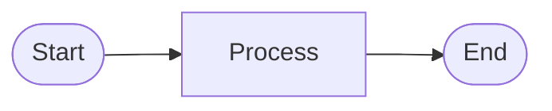

# Mermaid Export Examples

This document shows real examples of VPB processes exported to Mermaid format.

## Example 1: Simple Linear Process

### Source (VPB JSON)
```json
{
  "metadata": {
    "title": "Document Approval",
    "description": "Simple document approval process"
  },
  "elements": [
    {"element_id": "e1", "element_type": "Ereignis", "name": "Start", "x": 0, "y": 0},
    {"element_id": "e2", "element_type": "Prozess", "name": "Review", "x": 100, "y": 0},
    {"element_id": "e3", "element_type": "Prozess", "name": "Approve", "x": 200, "y": 0},
    {"element_id": "e4", "element_type": "Ereignis", "name": "End", "x": 300, "y": 0}
  ],
  "connections": [
    {"source_element": "e1", "target_element": "e2"},
    {"source_element": "e2", "target_element": "e3"},
    {"source_element": "e3", "target_element": "e4"}
  ]
}
```

### Exported Mermaid (LR - Left to Right)


## Example 2: Decision Process

### Exported Mermaid (TB - Top to Bottom)


## Example 3: Parallel Process

### Exported Mermaid


## Example 4: Container/Subprocess

### Exported Mermaid


## Visual Guide: Element Shapes

### Rectangles `[...]` - Standard Process Steps


### Diamonds `{...}` - Decisions


### Stadiums `([...])` - Start/End Events


### Subprocesses `[[...]]` - Containers


## Color Scheme

| Element Type | Color | Hex Code | Usage |
|-------------|-------|----------|-------|
| Events | Light Green | #90EE90 | Start/End events |
| Processes | Light Blue | #ADD8E6 | Standard tasks |
| Decisions | Wheat | #F5DEB3 | Decision points |
| Containers | Light Yellow | #FFFFE0 | Subprocesses |
| Error | Light Red | #FFB6C1 | Error states |

## Integration Examples

### GitHub README.md
````markdown
# Project Documentation

## Process Overview


````

### GitLab Wiki
Same as GitHub - native Mermaid support

### MkDocs
Add to `mkdocs.yml`:
```yaml
markdown_extensions:
  - pymdownx.superfences:
      custom_fences:
        - name: mermaid
          class: mermaid
          format: !!python/name:pymdownx.superfences.fence_code_format
```

### VS Code
1. Install "Markdown Preview Mermaid Support" extension
2. Open markdown file
3. Use preview (Ctrl+Shift+V)

### Online Editor
Visit [mermaid.live](https://mermaid.live/) and paste the code

## Tips and Tricks

### 1. Long Labels
Use line breaks with `<br>`:


### 2. Custom Styling
Add custom styles:


### 3. Subgraphs
Group related nodes:


### 4. Comments
Use `%%` for comments:


## Conversion to Images

Use mermaid-cli for image export:

```bash
# Install
npm install -g @mermaid-js/mermaid-cli

# Convert to PNG
mmdc -i process.md -o process.png

# Convert to SVG (vector)
mmdc -i process.md -o process.svg

# Convert to PDF
mmdc -i process.md -o process.pdf

# With custom theme
mmdc -i process.md -o process.png -t dark

# With custom background
mmdc -i process.md -o process.png -b transparent
```

## Best Practices

1. **Keep It Simple**
   - Limit to 10-15 nodes per diagram
   - Break complex processes into multiple diagrams

2. **Use Clear Names**
   - Short, descriptive labels
   - Avoid technical jargon when possible

3. **Consistent Direction**
   - LR for wide processes
   - TB for hierarchical processes
   - Stick to one direction per diagram

4. **Color Consistency**
   - Use colors consistently across diagrams
   - Match VPB color scheme for familiarity

5. **Version Control**
   - Commit `.md` files, not rendered images
   - Easy to see changes in git diff
   - Team can edit without special tools

## Troubleshooting

### Diagram Not Rendering
- Check syntax (proper arrows `-->`, braces, etc.)
- Ensure platform supports Mermaid
- Try copying to mermaid.live for validation

### Labels Overlapping
- Shorten labels
- Change diagram direction
- Use line breaks `<br>`

### Complex Layouts
- Break into multiple diagrams
- Use subgraphs for organization
- Consider using TB direction

## Further Reading

- [Official Mermaid Documentation](https://mermaid.js.org/)
- [Mermaid Flowchart Syntax](https://mermaid.js.org/syntax/flowchart.html)
- [GitHub Mermaid Support](https://github.blog/2022-02-14-include-diagrams-markdown-files-mermaid/)
- [VPB Mermaid Export Documentation](MERMAID_EXPORT.md)

---

**Generated by VPB Process Designer**  
**Version:** 0.5.0  
**Date:** 2025-12-31
