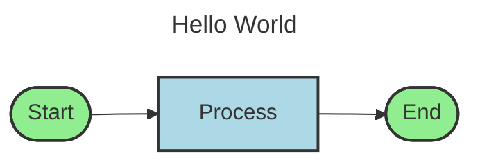
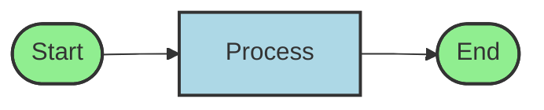
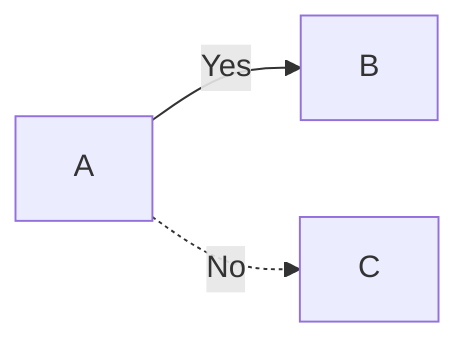
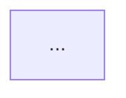

# Mermaid Diagram Export

## Overview

VPB now supports exporting process diagrams to Mermaid format, a popular text-based diagramming syntax that can be rendered in documentation, GitHub, GitLab, wikis, and many other platforms.

## What is Mermaid?

[Mermaid](https://mermaid.js.org/) is a JavaScript-based diagramming and charting tool that uses text definitions to create diagrams dynamically. It's widely supported in:

- **GitHub** and **GitLab** (markdown files)
- **Wiki systems** (Confluence, GitBook, etc.)
- **Documentation tools** (MkDocs, Docusaurus, etc.)
- **VS Code** (with extensions)
- **Static site generators** (Hugo, Jekyll, etc.)

## Benefits

1. **Version Control Friendly**: Text-based format works perfectly with git
2. **Easy to Edit**: No special tools needed, just a text editor
3. **Platform Independent**: Renders on any platform that supports Mermaid
4. **Lightweight**: Small file size compared to image formats
5. **Accessibility**: Can be read by screen readers and search engines

## Usage

### From Python Code

```python
from vpb.services.export_service import ExportService
from vpb.models.document import DocumentModel

# Load or create a document
doc = DocumentModel.from_dict(your_process_data)

# Create export service
service = ExportService()

# Export to Mermaid format
service.export_to_mermaid(
    document=doc,
    output_path="my_process.md",
    diagram_type="flowchart",  # or "graph"
    direction="LR"  # TB, LR, BT, or RL
)
```

### Configuration Options

#### Diagram Type
- `flowchart` (default): Modern flowchart syntax with better styling
- `graph`: Classic graph syntax

#### Direction
- `TB` (Top to Bottom): Vertical flow, top to bottom
- `LR` (Left to Right): Horizontal flow, left to right (recommended for wide processes)
- `BT` (Bottom to Top): Vertical flow, bottom to top
- `RL` (Right to Left): Horizontal flow, right to left

### Configuration via ExportConfig

```python
from vpb.services.export_service import ExportService, ExportConfig

config = ExportConfig(
    mermaid_diagram_type="flowchart",
    mermaid_direction="LR",
    mermaid_include_metadata=True,
    mermaid_style_elements=True
)

service = ExportService(config=config)
```

## Element Shape Mapping

VPB elements are automatically mapped to appropriate Mermaid shapes:

| VPB Element Type | Mermaid Shape | Visual |
|-----------------|---------------|--------|
| Ereignis, Prozess, VorProzess, NachProzess | Rectangle `[...]` | Rectangular box |
| Entscheidung, XOR, OR, AND | Diamond `{...}` | Decision diamond |
| Container | Subprocess `[[...]]` | Rounded rectangle |
| START, END | Stadium `([...])` | Rounded ends |

## Example Output

### Input: Simple Process
```json
{
  "metadata": {"name": "Hello World", "description": "Simple process"},
  "elements": [
    {"element_id": "S1", "element_type": "START_EVENT", "name": "Start"},
    {"element_id": "F1", "element_type": "FUNCTION", "name": "Process"},
    {"element_id": "E1", "element_type": "END_EVENT", "name": "End"}
  ],
  "connections": [
    {"source_element": "S1", "target_element": "F1"},
    {"source_element": "F1", "target_element": "E1"}
  ]
}
```

### Output: Mermaid Diagram


### Rendered Output

The above Mermaid code renders as:



## Features

### Metadata Support
Mermaid exports include document metadata in YAML frontmatter:
- Title
- Description
- Author
- Creation timestamp

### Automatic Styling
Each element type gets appropriate colors matching VPB's visual theme:
- Events: Light green
- Processes: Light blue
- Decisions: Wheat
- Containers: Light yellow

### Connection Types
Different connection types are visualized with appropriate arrows:
- `SEQUENCE`: Solid arrow `-->`
- `conditional`: Dotted arrow `-.->` (for conditional connections)

### Connection Labels
If connections have labels, they are included in the diagram:


## Integration with Documentation

### GitHub/GitLab README
Simply include the Mermaid code block in your README.md:

````markdown
# Process Documentation

## Process Flow


````

### MkDocs
Enable Mermaid support in `mkdocs.yml`:

```yaml
markdown_extensions:
  - pymdownx.superfences:
      custom_fences:
        - name: mermaid
          class: mermaid
          format: !!python/name:pymdownx.superfences.fence_code_format
```

### Confluence
Use the Mermaid macro or plugin to render diagrams.

## Advanced Usage

### Multiple Processes in One Document
You can combine multiple Mermaid diagrams in a single markdown file:

```markdown
# Process Documentation

## Main Process


## Subprocess A

```

### Live Preview
Use VS Code with the Mermaid Preview extension for live editing.

### Export to Other Formats
Convert Mermaid to images using [mermaid-cli](https://github.com/mermaid-js/mermaid-cli):

```bash
# Install mermaid-cli
npm install -g @mermaid-js/mermaid-cli

# Convert to PNG
mmdc -i process.md -o process.png

# Convert to SVG
mmdc -i process.md -o process.svg

# Convert to PDF
mmdc -i process.md -o process.pdf
```

## Best Practices

1. **Use Descriptive Names**: Element names should be clear and concise
2. **Choose Appropriate Direction**: 
   - Use `LR` for wide processes with many sequential steps
   - Use `TB` for hierarchical processes or decision trees
3. **Keep It Simple**: Mermaid works best with moderately complex diagrams
4. **Version Control**: Commit `.md` files instead of binary image formats
5. **Documentation**: Include the Mermaid source in your documentation

## Limitations

- **Complex Layouts**: Very complex diagrams may not render optimally
- **Custom Positioning**: Element positions are determined by Mermaid's layout algorithm
- **Styling Limits**: Advanced styling options are limited compared to SVG/PDF exports

## See Also

- [Mermaid Documentation](https://mermaid.js.org/)
- [Mermaid Live Editor](https://mermaid.live/)
- [VPB Export Service Documentation](../vpb/services/export_service.py)
- [GitHub Mermaid Support](https://github.blog/2022-02-14-include-diagrams-markdown-files-mermaid/)

## Changelog

### 2025-12-31
- Initial implementation of Mermaid export
- Support for flowchart diagrams with TB, LR, BT, RL directions
- Automatic element shape mapping
- Metadata inclusion
- Styling support
- Connection label support
