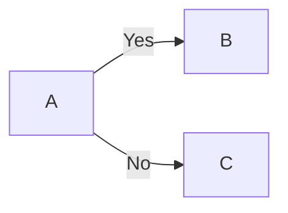
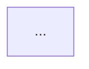
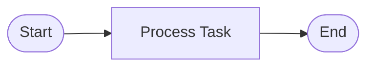
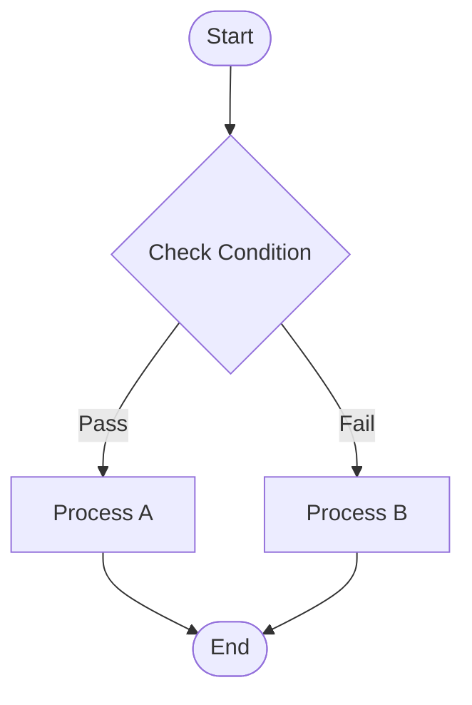
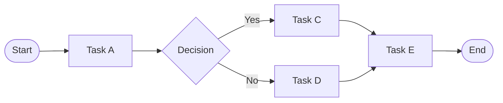

# Mermaid Diagram Import

## Overview

VPB now supports importing Mermaid flowchart diagrams and converting them to VPB process models. This allows you to:

- Import existing Mermaid diagrams from documentation
- Convert text-based flowcharts to visual VPB processes
- Collaborate using Mermaid's simple syntax
- Round-trip between Mermaid and VPB formats

## What is Mermaid?

[Mermaid](https://mermaid.js.org/) is a JavaScript-based diagramming and charting tool that uses text definitions to create diagrams dynamically. It's widely supported in:

- **GitHub** and **GitLab** (markdown files)
- **Wiki systems** (Confluence, GitBook, etc.)
- **Documentation tools** (MkDocs, Docusaurus, etc.)
- **VS Code** (with extensions)
- **Static site generators** (Hugo, Jekyll, etc.)

## Benefits of Mermaid Import

1. **Easy Collaboration**: Team members can sketch processes in simple text format
2. **Version Control**: Text-based diagrams work perfectly with git
3. **Quick Prototyping**: Rapidly create process flows using simple syntax
4. **Migration**: Import existing Mermaid documentation into VPB
5. **BPMN Compatible**: Only imports diagrams that can be represented as BPMN processes

## Supported Mermaid Features

### Diagram Types
- ✅ **flowchart** - Modern flowchart syntax (recommended)
- ✅ **graph** - Classic graph syntax
- ❌ **erDiagram** - Entity-relationship diagrams (not a process flow)
- ❌ **classDiagram** - UML class diagrams (not a process flow)
- ❌ **sequenceDiagram** - Sequence diagrams (not BPMN-compatible)
- ❌ **stateDiagram** - State diagrams (different semantics)

### Flow Directions
- **TB** (Top to Bottom) - Vertical flow, default
- **LR** (Left to Right) - Horizontal flow
- **BT** (Bottom to Top) - Vertical flow, inverted
- **RL** (Right to Left) - Horizontal flow, inverted
- **TD** (Top Down) - Alias for TB

### Node Shapes

| Mermaid Shape | Syntax | VPB Element Type | BPMN Element |
|---------------|--------|------------------|--------------|
| Rectangle | `[Text]` | Prozess (Task) | Task |
| Stadium | `([Text])` | Ereignis (Event) | Start/End Event |
| Diamond | `{Text}` | Entscheidung (Decision) | Gateway |
| Subprocess | `[[Text]]` | Container | Subprocess |

### Connection Types

| Mermaid Syntax | VPB Connection Type | Description |
|----------------|---------------------|-------------|
| `-->` | SEQUENCE | Solid arrow (sequence flow) |
| `---` | SEQUENCE | Solid line (alternative syntax) |
| `-.->` | INFORMATION | Dotted arrow (information flow) |

### Connection Labels
Mermaid connections can have labels:


These labels are preserved as connection descriptions in VPB.

### Metadata Support
Mermaid files can include YAML frontmatter:
```markdown
---
title: My Process
description: Process description
author: John Doe
---


```

The import service recognizes this metadata (currently parsed but not fully integrated into DocumentMetadata).

## Usage

### From Python Code

```python
from vpb.services.import_service import ImportService
from vpb.services.document_service import DocumentService

# Create import service
import_service = ImportService()

# Import Mermaid diagram
document = import_service.import_from_mermaid("my_process.md")

# Save as VPB format
doc_service = DocumentService()
doc_service.save_document(document, "my_process.vpb.json")
```

### With Custom Title

```python
document = import_service.import_from_mermaid(
    "process.md",
    title="Custom Process Name"
)
```

### Configuration Options

```python
from vpb.services.import_service import ImportService, ImportConfig

config = ImportConfig(
    mermaid_auto_layout=True,
    mermaid_default_spacing_x=200,
    mermaid_default_spacing_y=150,
    mermaid_start_x=100,
    mermaid_start_y=100,
    validate_bpmn_compatibility=True
)

service = ImportService(config=config)
```

## Example Imports

### Simple Linear Process

**Input (Mermaid):**
```markdown

```

**Result:**
- 3 VPB elements: Start (Ereignis), Process (Prozess), End (Ereignis)
- 2 connections: Start→Process, Process→End
- Automatic layout in left-to-right direction

### Process with Decision Gateway

**Input (Mermaid):**
```markdown

```

**Result:**
- 5 VPB elements including decision gateway (Entscheidung)
- Connection labels preserved ("Pass", "Fail")
- Top-to-bottom layout

### Complex Process Flow

**Input (Mermaid):**
```markdown

```

**Result:**
- 7 VPB elements with proper layout
- Multiple paths converging at Task E
- All connections and labels preserved

## Automatic Layout

The import service automatically calculates element positions using a layered layout algorithm:

1. **Topological Sort**: Arranges elements in layers based on dependencies
2. **Direction-Based Positioning**: Places elements according to flowchart direction (TB, LR, etc.)
3. **Configurable Spacing**: Control horizontal and vertical spacing between elements

The layout ensures:
- No overlapping elements
- Clear visual flow
- Proper spacing
- Respects flowchart direction

## Error Handling

### Unsupported Diagram Types

If you try to import an unsupported diagram type, you'll get a clear error:

```python
try:
    doc = service.import_from_mermaid("schema.md")
except UnsupportedDiagramError as e:
    print(f"Error: {e}")
    # Error: Diagram type 'erDiagram' cannot be converted to BPMN.
    # Only flowchart/graph diagrams are supported.
```

### File Not Found

```python
try:
    doc = service.import_from_mermaid("missing.md")
except MermaidImportError as e:
    print(f"Error: {e}")
    # Error: File not found: missing.md
```

### Invalid Diagram

```python
try:
    doc = service.import_from_mermaid("invalid.md")
except MermaidImportError as e:
    print(f"Error: {e}")
    # Error: No valid Mermaid diagram found
```

## Round-Trip Support

You can import a Mermaid diagram and export it back:

```python
from vpb.services.import_service import ImportService
from vpb.services.export_service import ExportService

# Import
import_service = ImportService()
doc = import_service.import_from_mermaid("input.md")

# Modify if needed
# ... make changes to doc ...

# Export back to Mermaid
export_service = ExportService()
export_service.export_to_mermaid(doc, "output.md")

# Or export to other formats
export_service.export_to_bpmn(doc, "output.bpmn")
export_service.export_to_pdf(doc, "output.pdf")
```

## BPMN Compatibility

The import service validates that imported diagrams are BPMN-compatible:

### ✅ BPMN-Compatible Features
- Sequential flows (tasks, events, gateways)
- Decision points (exclusive gateways)
- Start and end events
- Linear and branching flows

### ❌ Not BPMN-Compatible
- Entity-relationship diagrams
- Class diagrams
- Sequence diagrams
- State machines with different semantics

The validation can be disabled if needed:
```python
config = ImportConfig(validate_bpmn_compatibility=False)
```

## Limitations

1. **Subgraphs**: Currently not supported (future enhancement)
2. **Custom Styling**: Style definitions are ignored during import
3. **Complex Shapes**: Some Mermaid shapes are mapped to basic VPB types
4. **Exact Positioning**: Auto-layout may differ from Mermaid's rendering
5. **Parallel Gateways**: Not yet supported (planned)

## Best Practices

1. **Keep It Simple**: Simpler diagrams import more reliably
2. **Use Standard Shapes**: Stick to rectangle, stadium, diamond, subprocess
3. **Clear Labels**: Use descriptive names for tasks and events
4. **Test Import**: Verify imported diagrams match expectations
5. **Round-Trip Test**: Export to check if information is preserved
6. **BPMN Focus**: Design diagrams with BPMN process flows in mind

## Integration Example

Complete workflow from Mermaid to VPB to BPMN:

```python
from vpb.services.import_service import ImportService
from vpb.services.export_service import ExportService
from vpb.services.document_service import DocumentService
from vpb.services.validation_service import ValidationService

# 1. Import from Mermaid
import_service = ImportService()
doc = import_service.import_from_mermaid("process.md", title="Approval Process")

# 2. Validate the process
validation_service = ValidationService()
result = validation_service.validate_document(doc)
if not result.is_valid:
    print("Validation errors:")
    for issue in result.issues:
        print(f"  - {issue.message}")

# 3. Save as VPB format
doc_service = DocumentService()
doc_service.save_document(doc, "process.vpb.json")

# 4. Export to multiple formats
export_service = ExportService()
export_service.export_to_bpmn(doc, "process.bpmn")
export_service.export_to_pdf(doc, "process.pdf")
export_service.export_to_mermaid(doc, "process_exported.md")
```

## See Also

- [Mermaid Export Documentation](MERMAID_EXPORT.md)
- [Mermaid Official Documentation](https://mermaid.js.org/)
- [VPB Export Service](../vpb/services/export_service.py)
- [VPB Import Service](../vpb/services/import_service.py)
- [BPMN 2.0 Specification](https://www.omg.org/spec/BPMN/2.0/)

## Changelog

### 2026-01-22
- Initial implementation of Mermaid import
- Support for flowchart and graph diagrams
- Automatic layout calculation
- BPMN compatibility validation
- Comprehensive test coverage
- Shape mapping (rectangle, stadium, diamond, subprocess)
- Connection type mapping (solid, dotted)
- Label preservation
